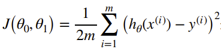
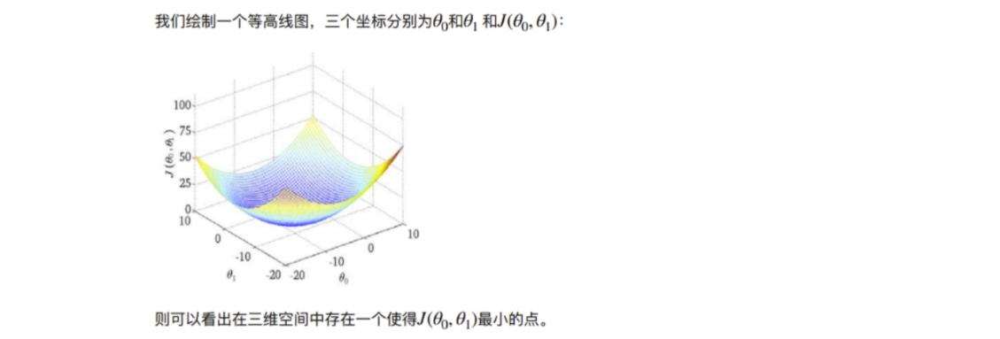
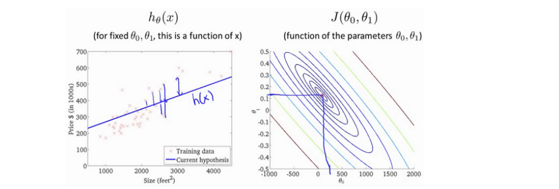
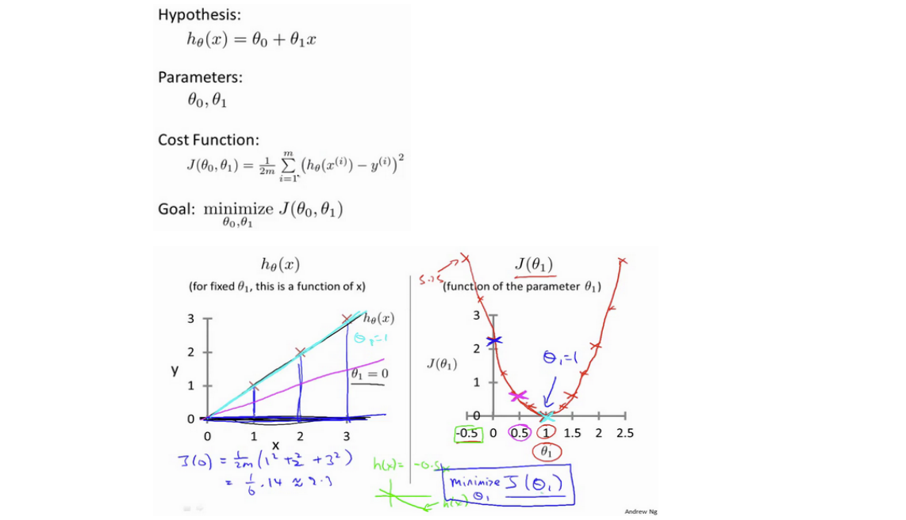
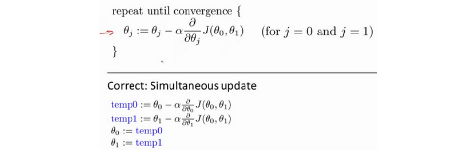
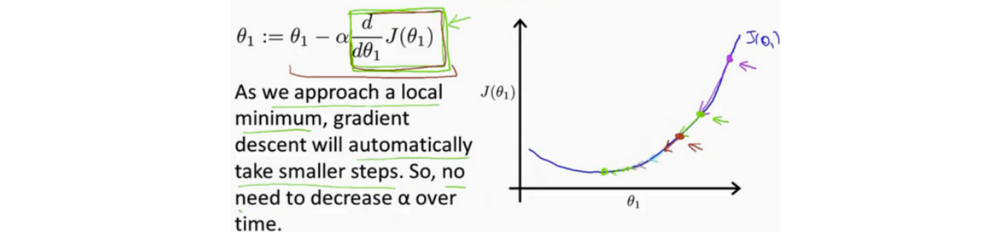
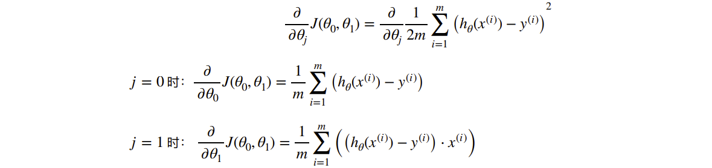
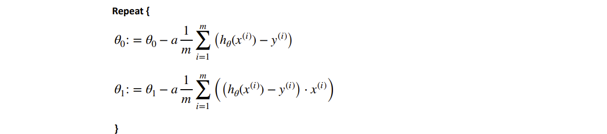

# First Week 无监督学习 & 监督学习 & 单变量线性回归 Linear Regression with One Variable

无监督算法分离声音：

```matlab
[w, s, v] = svd((repmat(sum(x.*x, 1), size(x, 1), 1).*x).*x);
```

### 模型表示

建模误差 modeling error

### 代价函数（平方误差（代价）函数）






以下是各参数齐备的直观理解：



### 梯度下降

是一个求函数最小值的算法，用来求代价函数 J 的最小值

背后的思想是：开始的时候随机选择一个参数组合（O1, O2, O3...），计算代价函数；然后寻找下一个让代价函数下降最多的参数组合。持续如此直到得到一个局部最小值（local minimum），因为没有尝试所有参数组合，所以不确定是否是全局最小值（global minimum）



重要的是同时正确更新 0 和 1 的方法，同步更新是更自然的实现。

即使学习率 a 是固定的，梯度下降也能够得收敛到局部最低点


### 梯度下降的线性回归

梯度下降和线性回归算法比较如图


对我们之前的线性回归问题运用梯度下降算法，关键在于求出代价函数的导数



则算法可以改写为

